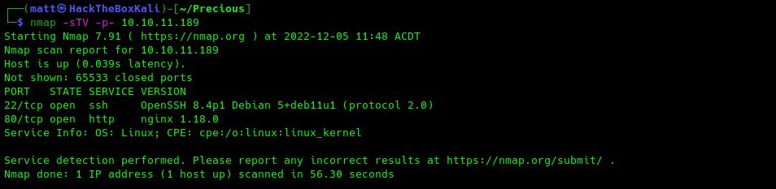

[//]: # (Project: GitHub Pages)  
[//]: # (Title: Blog Home)  
[//]: # (Author: M4773L)  
[//]: # (Date: 2022/11/29 11:57.42)  
[//]: # (Date_Modified: 2022/12/07 10:02.31)
[//]: # (WEBSITE_URL: http://m4773l.github.io)
[//]: # (GITHUB_REPO_URL: https://github.com/M4773L)

# Blog
&nbsp;

[//]: # (Begin Content Here)

## Precious
07/12/2022 - 10:02 ACDT  
Writeup of an easy HackTheBox machine named Precious. A simple machine that demonstrates what can happen when a vulnerablity is identified in an imported package, you will witness other security mis-configurations which allow the target host to be easily comprimised.    
  
[Check out the post](././Writeups/HTB/Machines/Precious)
&nbsp;

## Hello World
30/11/2022 - 12:45 ACDT  
Welcome to my blog, this is my first & long overdue blog post. I hope that you find something that interests you and hopefully learn something along the way.  
&nbsp;

Please note: I am currently testing a Python application to handle management of this page on my behalf..
