[//]: # (Project: GitHub Pages)  
[//]: # (Title: Squashed HTB Writeup)  
[//]: # (Author: M4773L)  
[//]: # (Date: 2022/11/16 07:33.42)  
[//]: # (Date_Modified: 2022/11/29 07:45.00) 
[//]: # (WEBSITE_URL: http://m4773l.github.io)
[//]: # (GITHUB_REPO_URL: https://github.com/M4773L)

# Squashed HTB Writeup

## Port-scan Results

###### Nmap - TCP Aggressive
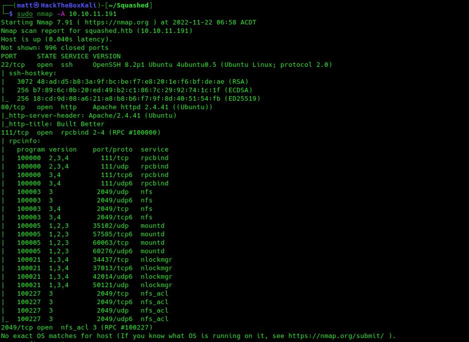  
Beginning with an agressive Nmap scan we will see which TCP ports are open. The aggressive '-A' flag is handy for CTF situations as it enables OS & service detection, script scanning and traceroute. The downside; aggressive is noisy! 

###### Nmap - TCP Connect - All Ports with Service Identification
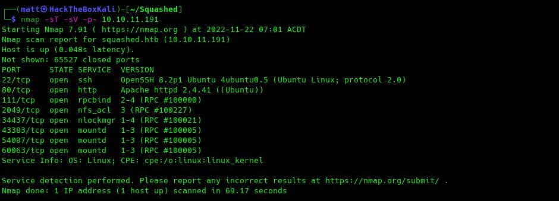  
TCP connect scan ('-sT') of all ports ('-p-') with service / service-version detection enabled using the '-sV' flag. By scanning all ports we will identify any services missed by the aggressive scan or services running on a custom port(s).  

###### Nmap - UDP - Top Ports
  
A simple UDP scan will identify any services with open UDP ports. UDP in general is slower than TCP although offers more reliability, therefore as you would probably expect UDP scans are slow.

From the scan results:

	Proto | Port | Service  | Note
	----- | ---- | -------  | ----
	TCP   | 22   | SSH      | No credentials - Leave until we have credentials or RSA key.
	TCP   | 80   | HTTP     | We will make a start by enumerating the website.
	TCP   | 111  | RPC-Bind | Take a look at what ports are mapped by the RPC-Bind server.
	TCP   | 2049 | NFS-ACL  | Explore what is shared and other possible vulnerable configuration options.
&nbsp;

## Port 80 - HTTP
Lets have a look at what is happening on the Apache web server at port 80.

###### Burp Suite
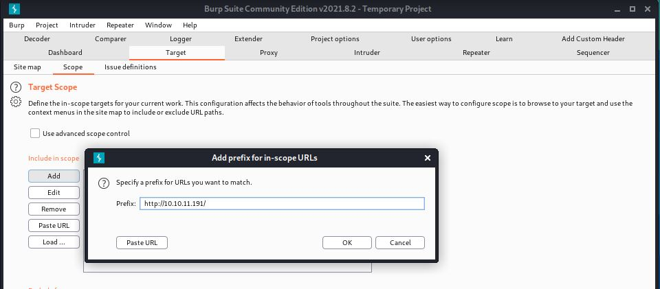  
Fire up Burp Suite and add the target's IP to the target scope. Burp suite is somewhat of a swiss army knife of tools, at this stage I will simply be using the proxy to review HTTP requests and responses from while navigating around the site. 

###### Website
  
The website is largely static, there are input fields for searching and making contact however, these are non-functional. Trying to access any of the links (ie. Services, About, Shop, Login) is also unsuccessful, the hyperlinks are internal links which refence themselves on the page.   
&nbsp;

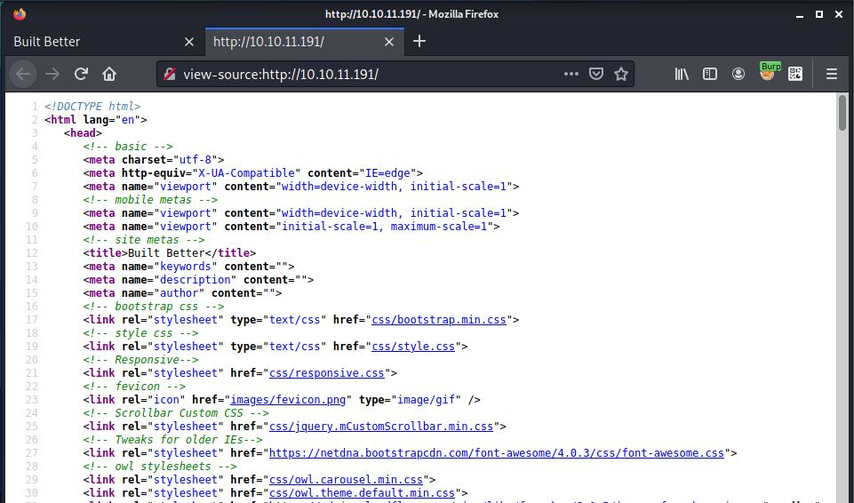  
....
SNIP
....
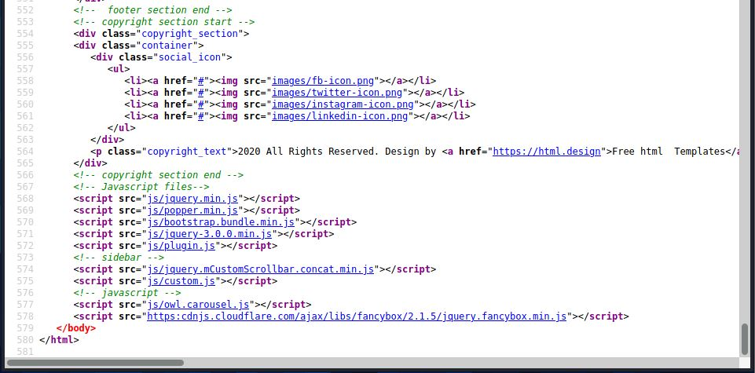  
Taking a look through the homepage's source code. As the homepage indicates, it is rather uneventful with not much going on. There are a few scripts reffered to at the bottom of the page, but these appear to be the standard scripts incuded with the Javascript library.  

###### Custom.js
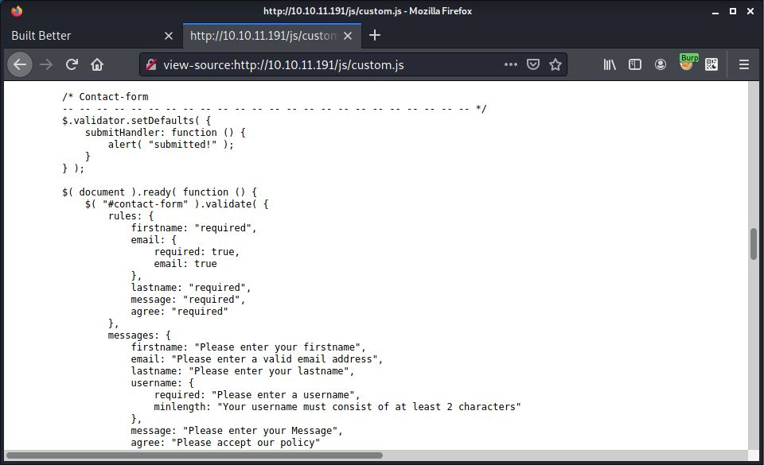  
Looking through 'custom.js' you can see the contact-form function. Besides that, the file is pretty standard with no obvious pathway forward.

###### Directory Brute-Force
A quick brute-force of the target to identify any directories or interesting files being served by the targets HTTP server.

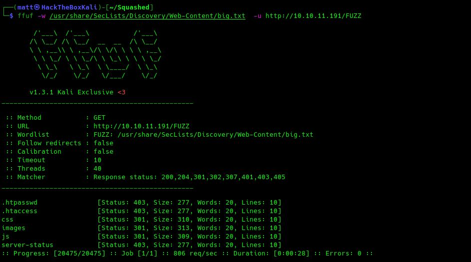  
Much as the homepage indicated, there isn't much happening at port 80. The results show a standard Apache web server's default files as well as the: 'css', 'images' & 'js' directories which are referenced on the homepage. As the homepage was not indicating much and none of the links were working, I opted to use the 'big.txt' wordlist from the Seclists Repository.  
Check out Seclists: https://github.com/danielmiessler/SecLists
&nbsp;

## Port 111 - RPC Bind
RPC-Bind is a utility service which is responsible for mapping remote procedural call (RPC) program numbers to a universal address. It is somewhat similar to a DNS server in which services / clients send queries to the RPC-Bind server and response is sent with the appropriate port.

###### RPC Info
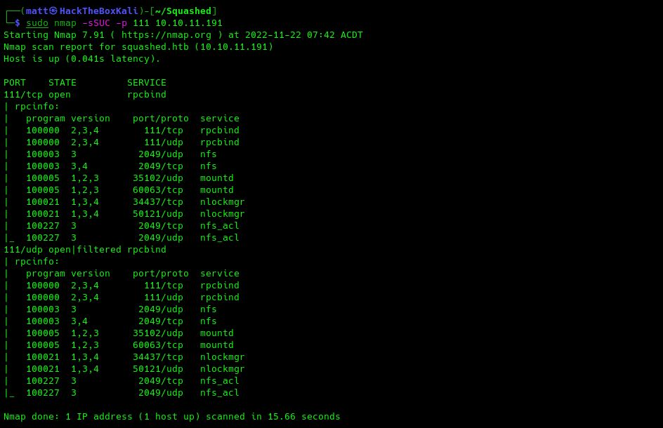  
Using Nmap take a look at which ports are configured in the port map on the target machine. Breaking down the command '-sSUC' is equivalent to synchronise scan (TCP), UDP scan & to scan with the default scripts.  
The '-p 111' flag specifies the port followed by the target hosts IP. In the results we have network file system (NFS) mapped to port 2049, as well as NFS's associated services; mountd, nlockmgr and nfs_acl. 

###### Network File System (NFS)
Network file system is a network storage protocol that is used to allow clients to access shared directories and files over a network. The protocol relies upon RPC-Bind (server-side) to respond to requests from clients to identify which port the 'nfsd' service (NFS daemon) is listening at. 
Security vulnerabilities can be introduced by a poorly configured NFS implementation.

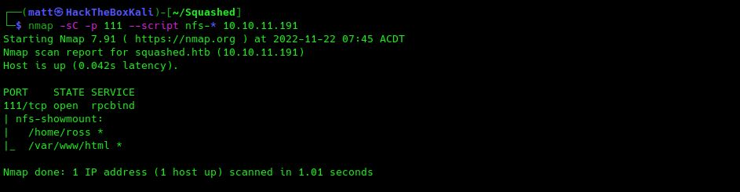  
Running an Nmap script scan we will take a look at which directories are configured for export by NFS. We can see in the results that Nmap identified 2 directories:
* '/home/ross' <-- Home directory for user ross.
* '/var/www/html' <-- Default locaction for web server.

Lets mount these directories to our local Kali instance and have a look at the contents.

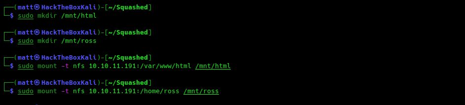  
First you will need to make some new directories, for this machine I simply created 'ross' and 'html' in the '/mnt' directory. You can then proceed to attach the identified directories using the 'mount' command, the '-t' flag specifies the type of file system we are mounting followed by the targets IP address, targets exported directory and finally the location of where the directories we created locally to mount to. 

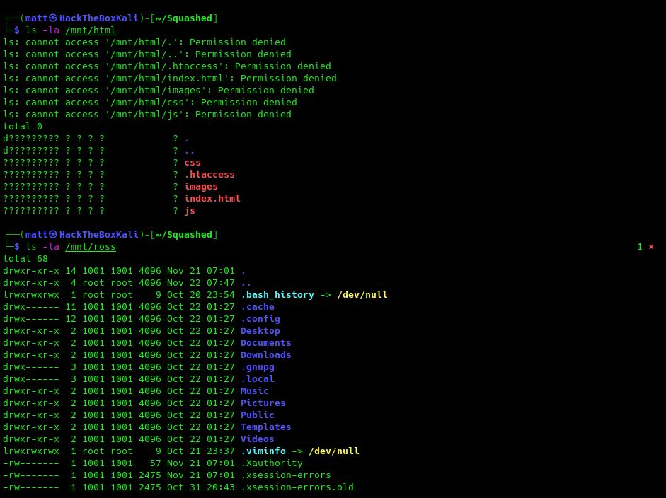  
Attempting to list the contents of '/var/www/html' you can see we received the 'Permission Denied' error meaning we do not currently have the appropriate permissions to read this directory. Listing the contents of the ross's home directory proves a little more fruitful, we can read the majority of the files and directories. The '.Xauthority' file in ross's home directory probably contains a cookie for Xauth, which is used in authentication for X-sessions.

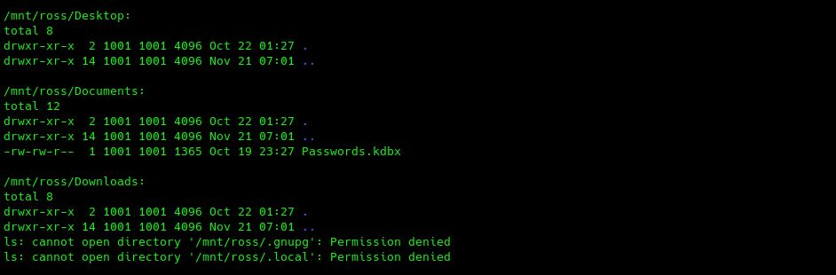  
Listing out the contents in user ross's home directory recursively most directories are empty however, in '/home/ross/Documents/' there is a file named 'Passwords.kdbx'. 

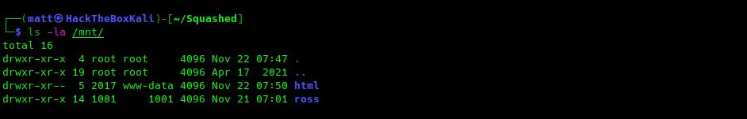  
Checking out the UID and the GID for the mounted file systems, we can see that ross's UID & GID are 1001. The web root directory has a UID of 2017 and the user group is 'www-data'.

## Keepass Database File
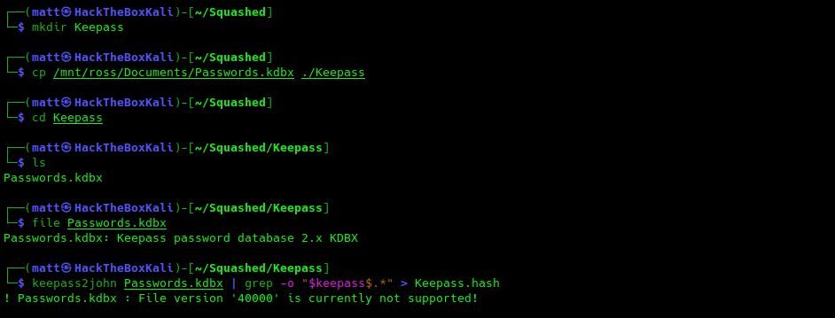  
I will copy the Keepass DB file over to my working directory for this target, using the 'file' command I will verify that the file is actually a Keepass DB file. Attempting to extract the hash from the DB file using keepass2john is unsuccessful due to the Keepass DB file's version.

For more information on cracking Keepass DB hashes with Hashcat: https://github.com/patecm/cracking_keepass

## Foothold
By creating a new user within my Kali VM, I can set the user and group ID's to '2017' to impersonate the owner of the '/var/www/html'. From 
there I will upload a PHP reverse shell, trigger the shell with curl and receive a callback to my listener.

###### Game Plan
1. Create a new user, change user & group ID.
2. Prepare a PHP reverse shell.
3. Start a Netcat listener.
4. Copy the reverse shell to the mounted NFS share: '/mnt/html'.
5. Trigger the reverse shell.
6. Receive callback at listener.

###### Prepare our new user
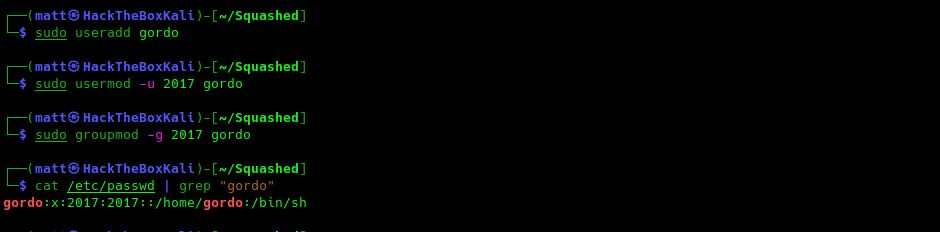  
Add a new user, I chose 'gordo'. Modify the new uses UID with 'usermod' and the GID using 'groupmod'. Finally take a look at '/ect/passwd' to
check that your user has the correct user and group ID.

###### Prepare PHP Reverse Shell
When solving CTF boxes I generally opt for a simple reverse shell from PentestMonkey, for this challenge I will be using:  
https://github.com/pentestmonkey/php-reverse-shell/blob/master/php-reverse-shell.php
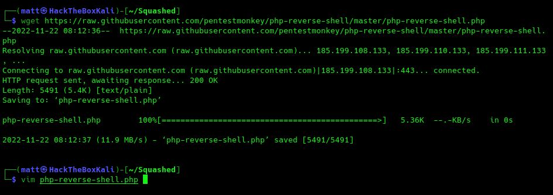  
Retrieve the file 'php-reverse-shell.php' from PentestMonkey's Github repository using Wget. Open the PHP file in your text editor of choice.

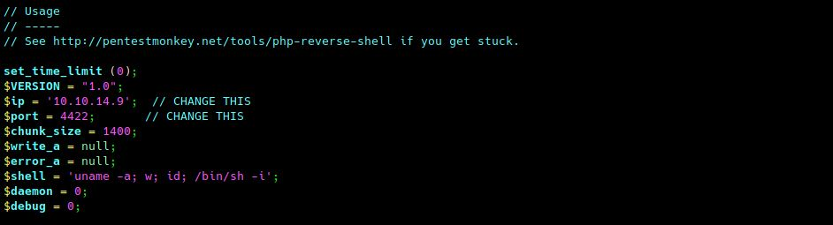  
Using Vim or your editor of choice, open the reverse shell and update the IP address and Port to match where you would like the shell to connect to.

###### NC Listener
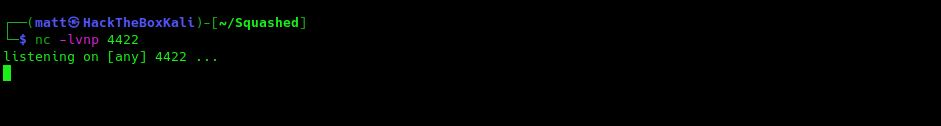  
Start a Netcat listener on a port of your choice.

###### Copy & Trigger Reverse Shell
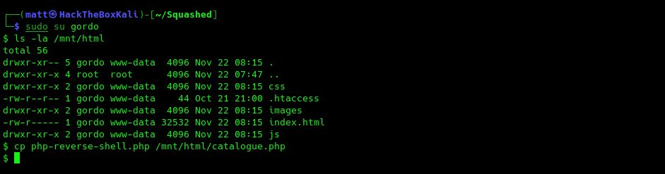  
Switch user to your created user, in my case 'gordo' we can now list the contents of the mounted file system '/var/www/html'. Copy your modified reverse shell into the 'hmtl' directory.

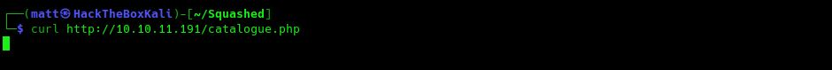  
Make a request using Curl to trigger your reverse shell.

###### Callback At NC Listener
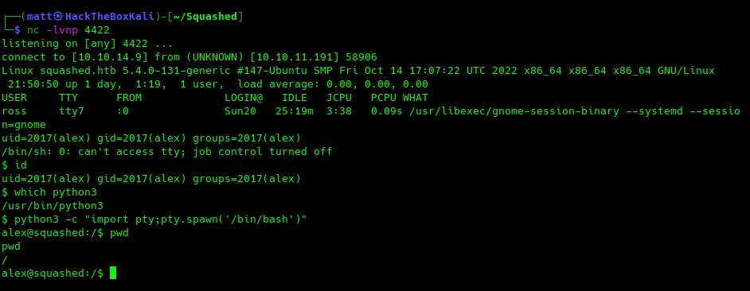  
Receive a callback at your Netcat listener from the target host, with the 'id' command we can see that we have a shell as user 'alex'. Checking if python3 is install with 'which python3' confirms python3's presence and we can slightly upgrade our shell / prompt.

###### User Flag
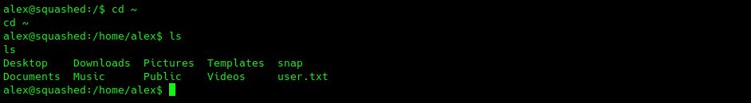  
Cat out the user flag.
&nbsp;

## Privilege Escalation

###### Enumeration
When solving CTF boxes / challenges I Generally start by looking to see if the current user can run any commands as 'sudo' or has any cronjobs.

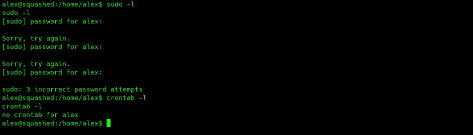  
Checking if Alex can run any command as 'sudo' or if their are any cronjobs running, both are unfruitul.

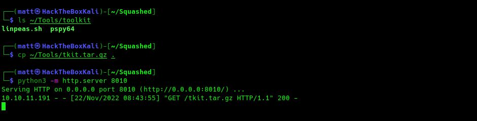  
I keep a tarball containing Linpeas and Pspy64 to tranfer to targets for privilege escalation purposes. I will serve the file with a simple Python HTTP server.

  
Retrieve the tarball from the Python HTTP server using Wget, extract the archive, make linpeas executable using 'chmod +x' and execute linpeas with the output to a file. 
* Note: Linpeas failed for me on this occasion and I didn't take a look at the created file until later on which resulted in a change of text colour in the terminal.

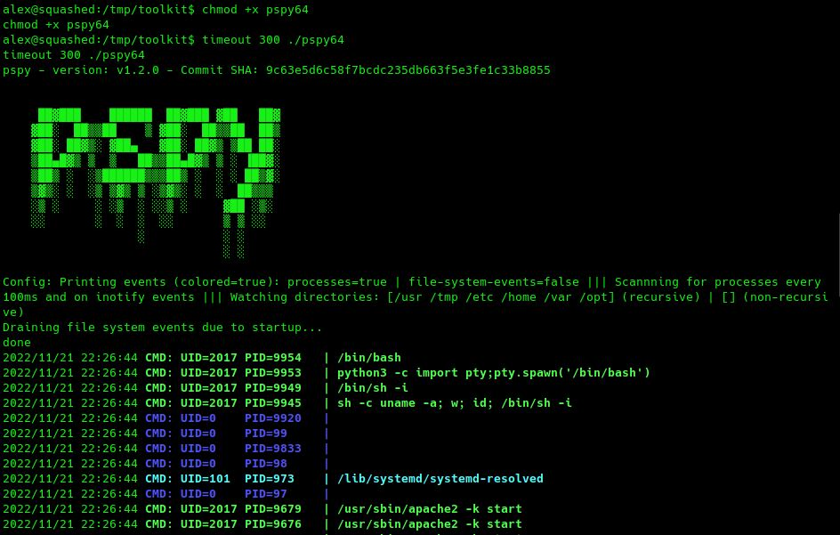  
.... SNIP ....
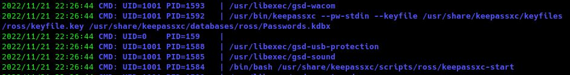  
.... SNIP ....
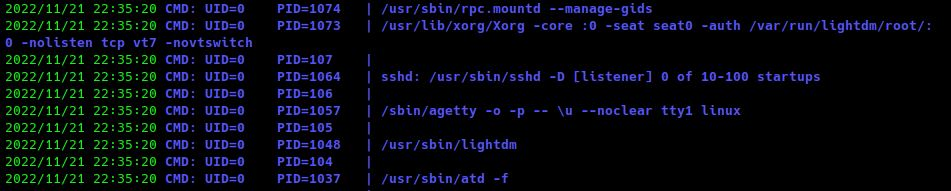  
.... SNIP ....
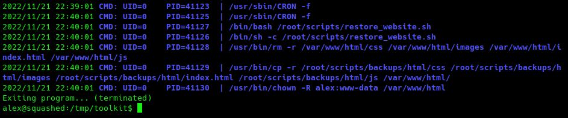  
Give pspy64 execuatable permission using 'chmod +x'. Now seeing as we do not have a full-shell, as soon as I attempt to exit Pspy64 using 'ctrl +c' I will kill my Netcat listener instead losing the shell altogether. In this situation I generally use the 'timeout' command as a means to kill the process after a specified amount of time. For this host I ran it for 300 seconds (5 minutes) and I did run the program a few times.

Potentially Interesting Processes:
* /usr/bin/keepassxc --pw-stdin --keyfile /usr/share/keepassxc/keyfiles/ross/Keyfile.key /usr/share/keepassxc/databases/ross/Password.kdbx
* /bin/bash /usr/share/keepassxc/scripts/ross/Keepassxc-start
* /usr/lib/xorg/Xorg -core :0 -seat -seat0 -auth /var/run/lightdm/root/0: -nolisten tcp vt7 -novtswitch 
* /usr/sbin/lightdm
* /bin/bash /root/scripts/restore_website.html

###### NFS Config
The main configuration for NFS is stored in the file '/etc/exports' which is where the export options of the shared directories are defined. Their are multiple vulnerabilities that can be introduced by a poorly configured NFS service.   

For more information on available options check out: https://www.thegeekdiary.com/understanding-the-etc-exports-file/ 

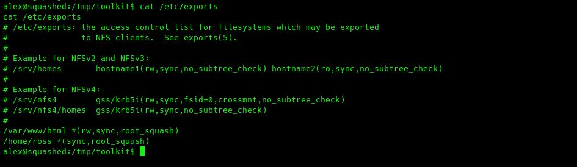  
The exports file shows the NFS configuration options. We can see that root_squash & sync is enabled for both shares and 'rw' is enabled for the web root.

###### Game Plan
From the user ross's home directory we mounted earlier, there was an '.Xauthority' file. 
As we know Keepass is running as root, hopefully by taking a window dump of the virtual display we can view some passwords.

1. Create another user in my Kali VM to impersonate the user 'Ross'
2. Access the '.Xauthority' file in Ross's home directory.
3. Copy the '.Xauthority' file to the target.
4. Export the Xauthority file location as an environment variable.
5. Take a screenshot of the user 'alex's' desktop using 'xwd'.

###### Prepare User
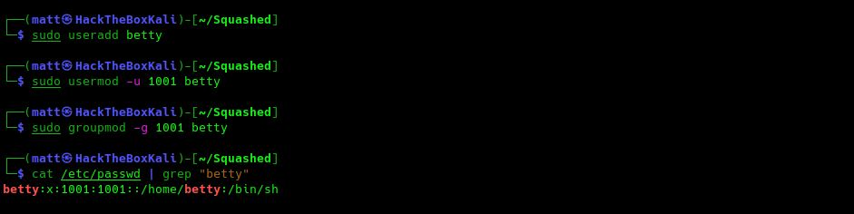  
Like we did to access the Apache web root share, create a new user on your localhost, change the user ID and group ID. I created a user named 'betty' with a user and group ID of 1001 confirmed by checking the '/etc/passwd' file for 'betty'.

###### Access The '.Xauthority' File
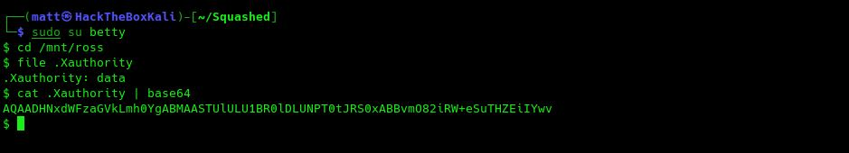  
Switch to our newly created user, change directory to the location where we have mounted the target home directory for user 'ross'. Running the file command shows that we are dealing with data therefore we will use base64 to encode the data. I copied the result to my clipboard for use in the next step.

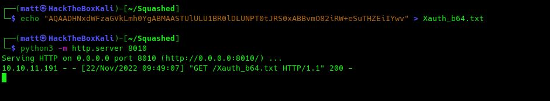  
Echo the base64 encoded data to a file and serve the file with a Python3 HTTP server.

###### Copy The File To Target
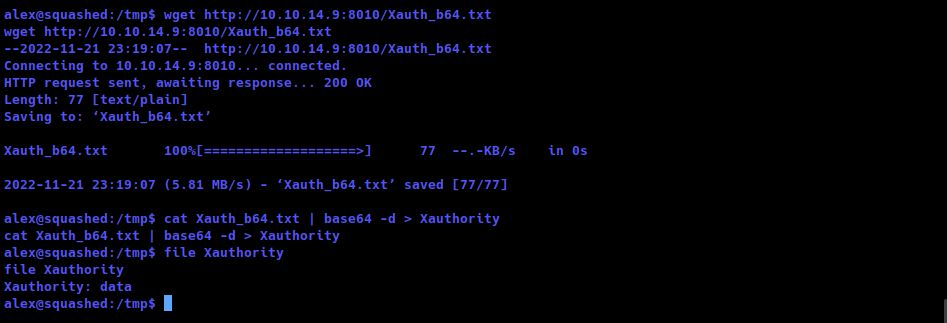  
Using Wget, retrieve the Xauthority file from the Python HTTP server. Using 'cat' I will read the file piping the contents through base64 with the '-d' flag to decode the base64 string. The output will then be directly outputted to a file named Xauthority.

###### X Window Dump (XWD)
X Window Dump is a command-line application which is used to take screensots of either a whole window or an application window and can output the content to an '.xwd' image. In this case we will use the Xau

For more information on XWD, take a look at: https://linux.die.net/man/1/xwd or use the command 'man xwd'.

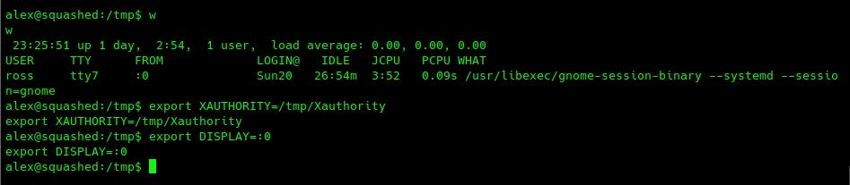  
By pressing 'w' we can view the currently logged in user(s), under the 'From' header we can see that the the display is ':0' meaning this is the first X connection. We will then export both the Xauthority file location and the display as environment variables.

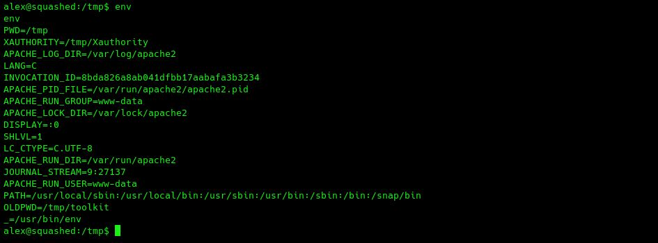  
Using the 'env' command check the environment variables we defined are correct.

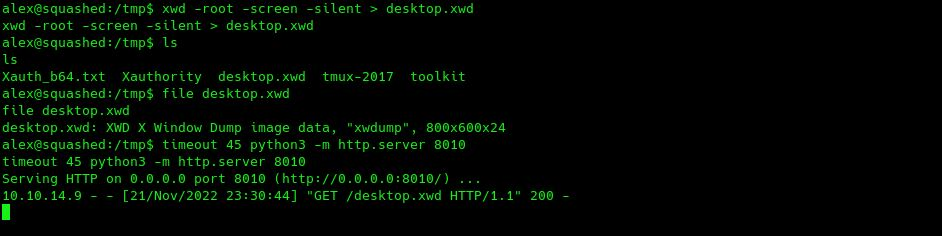  
Using xwd we will capture a screenshot of the root users desktop. The following flags are used; 
* '-root' - which specifies we would like to select the root window for the screen dump.
* '-screen' - the request to obtain the image should be undertaken as root.
* '-silent' - operate silently.

The capture will be saved to a file named 'desktop.xwd'. Using the combination of 'timeout' and a Python3 HTTP server to host the file.

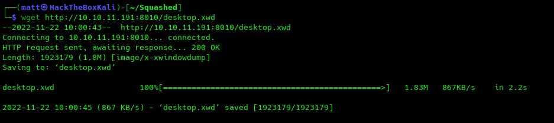  
Download the window dump file to your local host, I used Wget.

###### Convert Image
When it comes to converting images there are numerous tools available, today I will be using an online tool at 'convertio.co'.  Note: If this was a real pen-test you should convert the image locally using 'convert' from the ImageMagick tool suite.

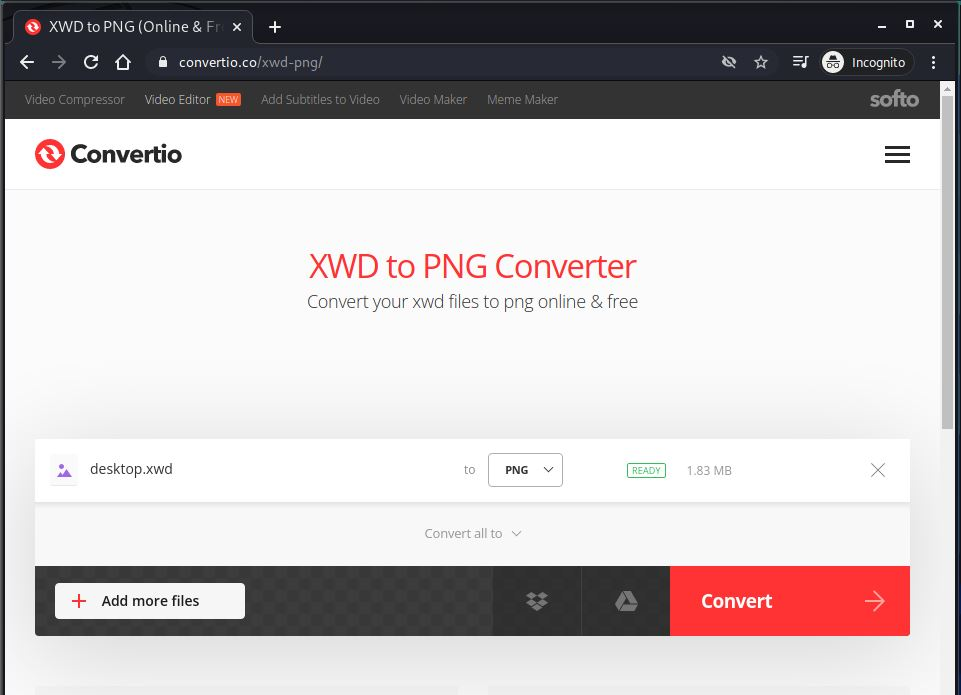  
You can see I have the x-window dump file selected for converion and am ready to press convert to proceed.

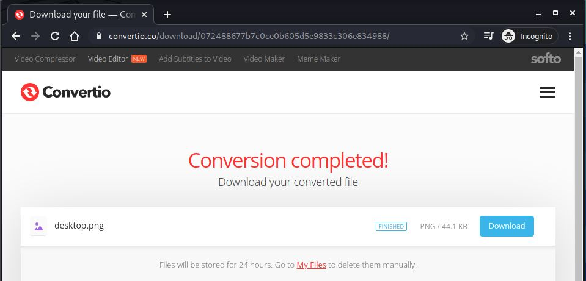  
Download the converted file once complete.

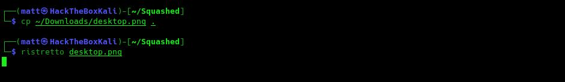  
Copy the file to your working directory and open the image to have a look. I used ristretto to open the image.

###### Root Desktop
  
Taking a look at the screenshot and BOOM, the root user has Keepass open and their is the root password in plain-text.

* Creds: root:cah$mei7rai9A
&nbsp;

## SSH As Root
###### Simple
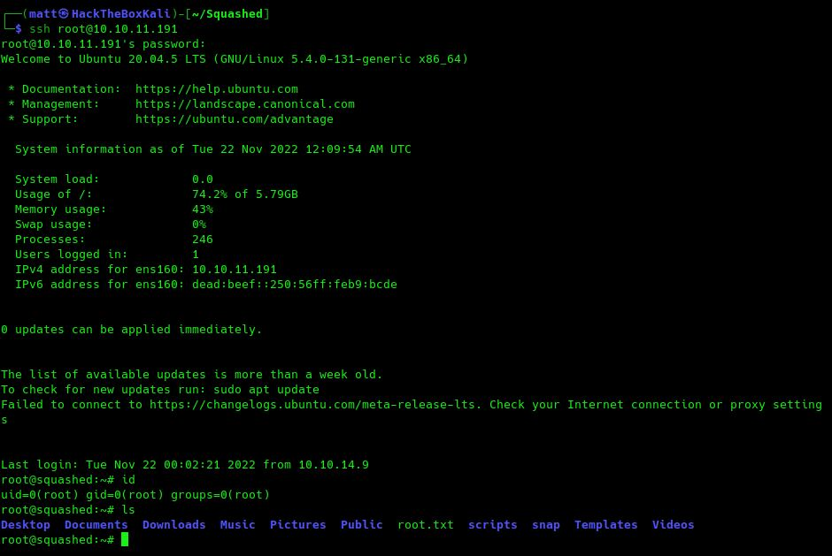  
SSH into the target as root and supply the password when requested.

###### Alternative
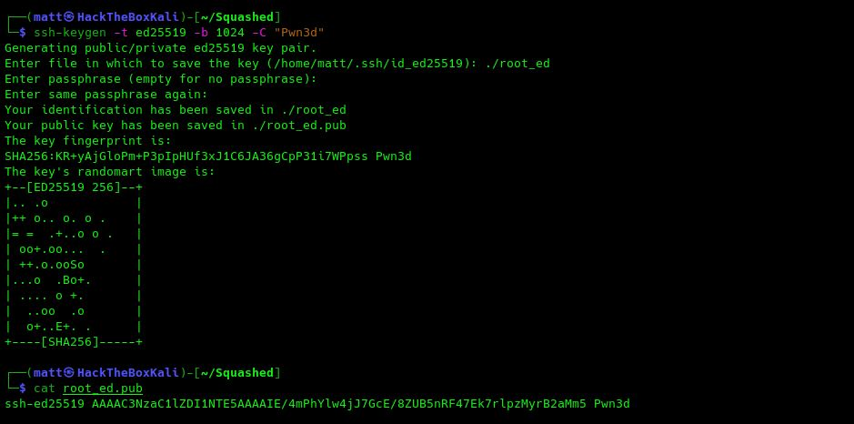  
Generate an SSH keypair, I tend to lean towards 'ed25519' or other elyptic curve based keys pair mainly due to the length of the key. 

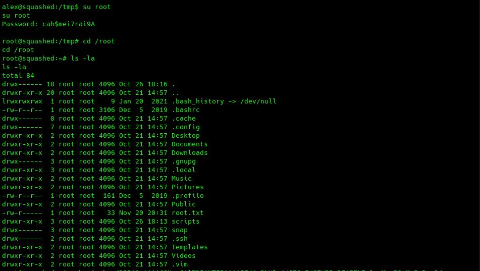  
Switch to the root user in the shell we have on the target and change directory to root. Listing the contents we can see that '.ssh' is present.

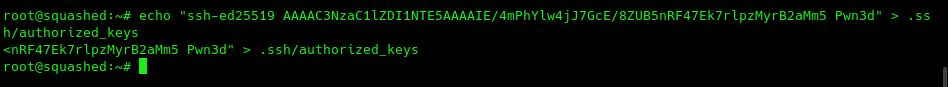  
Echo the the public key into file at '/root/.ssh/authorized_keys'.

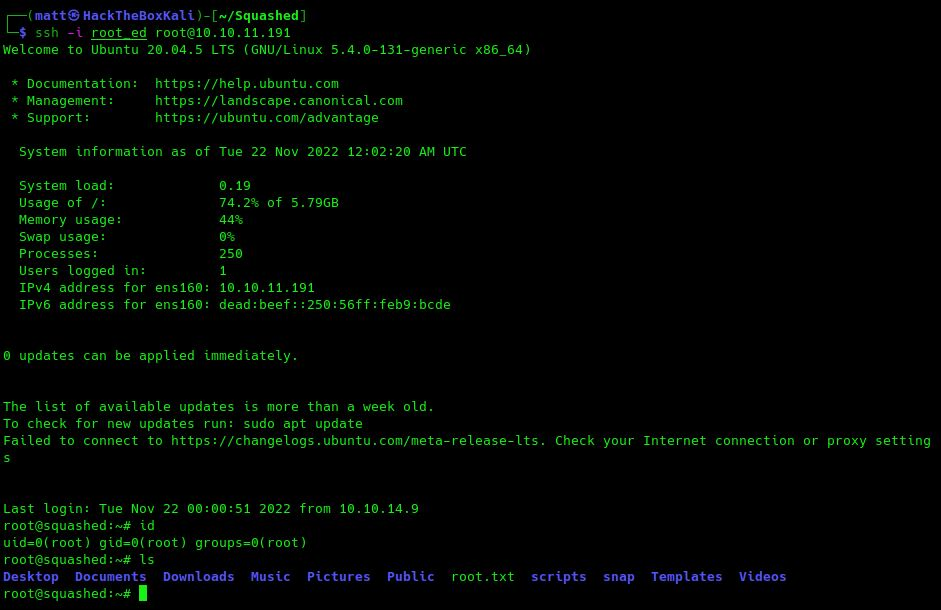  
SSH into the target as root using your private SSH key.
&nbsp;

## Cleanup
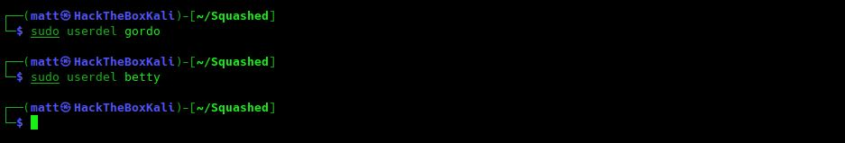  
Be sure to remove the users you created on your localhost to access the NFS shares.

## Restore-Website.sh
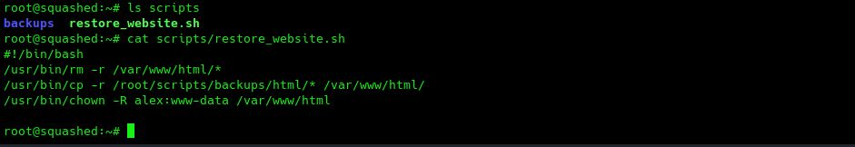  
If you noticed your shell was disapearing or what was happening to the files in the web root, this script removes all files and directories, then copies the files from a backup into the web root before recursively changing ownership.

* Note: This is my first HTB Writeup.